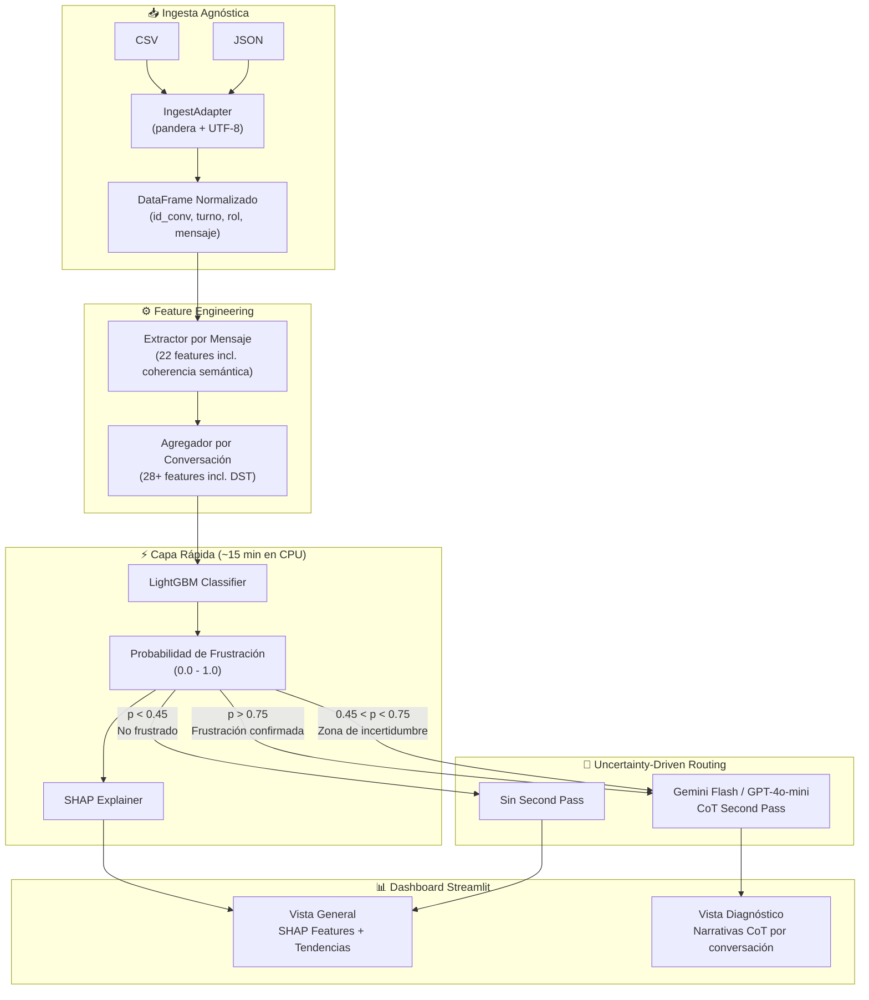

# ConversaSense AI — Plan de Implementación v2.0

Arquitectura Híbrida: Online Cascade Learning (LightGBM + LLM Second Pass) para detección de frustración multilingüe.

> [!IMPORTANT]
> **Cambio arquitectónico mayor vs. v1.0**: Se descartó Teacher-Student con Llama 3 8B. Se adopta LightGBM + Features Heurísticas como motor principal, con LLM API solo para diagnóstico narrativo de casos críticos.

---

## Arquitectura Final



---

## Diccionario de Features Heurísticas (Feature Engineering)

### Nivel 1: Features por Mensaje (Per-Message)

Extraídas de cada mensaje individual del corpus.

| # | Feature | Tipo | Descripción | Señal de Frustración |
|---|---------|------|-------------|---------------------|
| 1 | `message_length` | int | Número de caracteres del mensaje | Mensajes muy cortos (resignación) o muy largos (queja) |
| 2 | `word_count` | int | Número de palabras | Similar a message_length pero normalizado |
| 3 | `uppercase_ratio` | float | Proporción de caracteres en mayúsculas (0.0-1.0) | >0.5 indica grito/énfasis |
| 4 | `exclamation_count` | int | Conteo de signos de exclamación (!) | Intensidad emocional |
| 5 | `question_mark_count` | int | Conteo de signos de interrogación (?) | Confusión, demanda de respuesta |
| 6 | `ellipsis_count` | int | Conteo de puntos suspensivos (...) | Resignación, sarcasmo |
| 7 | `is_user_typing` | bool | True si el usuario escribió texto libre, False si usó botón | Texto libre = mayor probabilidad de frustración |
| 8 | `role` | cat | "user" o "bot" | Para filtrar features por rol |
| 9 | `has_negation` | bool | Contiene negaciones ("no", "não", "nunca", "jamás") | Rechazo de la respuesta del bot |
| 10 | `has_profanity` | bool | Contiene lenguaje hostil (diccionario configurable ES/PT) | Señal directa de frustración |
| 11 | `response_time_seconds` | float | Segundos entre este mensaje y el anterior | Latencia alta del bot o pausa larga del usuario |
| 12 | `turn_position` | int | Posición ordinal del mensaje en la conversación | Frustración tiende a aparecer después del turno 4-6 |
| 13 | `language` | cat | "es" o "pt" (detección automática) | Contexto para diccionarios de señales |
| 14 | `has_char_elongation` | bool | Repetición anómala de caracteres ("taaaaan", "nooooo") | Marcador ortográfico de sarcasmo/énfasis |

### Nivel 1b: Features de Coherencia Semántica (Per-Turn Pair)

Calculadas entre cada par consecutivo usuario→bot para medir si el bot responde algo relevante.

| # | Feature | Tipo | Descripción | Señal de Frustración |
|---|---------|------|-------------|---------------------|
| 15 | `cosine_similarity` | float | Similitud del coseno entre embedding del usuario y respuesta del bot (usando XLM-RoBERTa) | Valor bajo = bot respondió algo irrelevante |
| 16 | `jaccard_index` | float | Índice de Jaccard (overlap de tokens) entre solicitud del usuario y respuesta del bot | Valor bajo = quiebre del diálogo |

### Nivel 2: Features del Bot por Mensaje (Bot Behavior Signals)

Extraídas solo de mensajes del bot para detectar patrones de fallo.

| # | Feature | Tipo | Descripción | Señal de Frustración |
|---|---------|------|-------------|---------------------|
| 17 | `is_fallback` | bool | Bot dice "no entendí" / "não compreendi" | Señal crítica: bot falló |
| 18 | `is_apology` | bool | Bot dice "disculpa" / "lo siento" / "desculpe" | Patrón apologético que diluye frustración |
| 19 | `is_flow_reboot` | bool | Bot pregunta "¿Qué te gustaría hacer?" / "O que deseja?" | Reinicio de flujo = frustración alta |
| 20 | `is_capability_error` | bool | Bot expresa incapacidad ("no puedo" / "não consigo") | Abandono se dispara aquí |
| 21 | `bot_response_length` | int | Longitud de la respuesta del bot | Respuestas genéricas son más cortas |
| 22 | `offers_human_handoff` | bool | Bot ofrece transferir a agente humano | Indicador de escalamiento |

### Nivel 2b: Features de Dialog State Tracking (DST Deviation)

Señales de desviación del flujo conversacional del bot.

| # | Feature | Tipo | Descripción | Señal de Frustración |
|---|---------|------|-------------|---------------------|
| 23 | `is_irrelevant_dst` | bool | Bot inicia un estado de diálogo (DST) que no corresponde a la solicitud del usuario | Altamente predictivo de abandono |
| 24 | `is_premature_dst_exit` | bool | Bot abandona el flujo actual antes de resolverlo (cambia de tema sin cierre) | Desviación prematura = frustración |

### Nivel 3: Features Agregadas por Conversación (Conversation-Level)

Calculadas agrupando todos los mensajes de una conversación.

| # | Feature | Tipo | Descripción | Señal de Frustración |
|---|---------|------|-------------|---------------------|
| 25 | `total_turns` | int | Número total de intercambios (user+bot) | Conversaciones largas = más probabilidad |
| 26 | `user_message_count` | int | Mensajes del usuario | Más mensajes = más esfuerzo |
| 27 | `bot_fallback_count` | int | Veces que el bot dijo "no entendí" | Acumulación de fallos |
| 28 | `bot_reboot_count` | int | Veces que el bot reinició el flujo | Patrón de abandono top |
| 29 | `bot_apology_count` | int | Veces que el bot se disculpó | Patrón apologético acumulado |
| 30 | `user_repetition_count` | int | Veces que el usuario repitió la misma solicitud (similitud coseno >0.85 entre turnos) | Señal directa: bot no resolvió |
| 31 | `user_repetition_ratio` | float | repetition_count / total_turns | Normalizado por longitud |
| 32 | `uppercase_messages_count` | int | Mensajes del usuario con >50% mayúsculas | Escalamiento de tono |
| 33 | `max_consecutive_user_msgs` | int | Máximo de mensajes consecutivos del usuario sin respuesta útil del bot | Monólogo de frustración |
| 34 | `avg_user_message_length` | float | Longitud promedio de mensajes del usuario | Mensajes más largos = quejas elaboradas |
| 35 | `message_length_variance` | float | Varianza de longitud de mensajes del usuario | Alta varianza = tono errático |
| 36 | `negation_count` | int | Total de negaciones del usuario | Acumulación de rechazo |
| 37 | `profanity_present` | bool | Al menos un mensaje con lenguaje hostil | Flag binario directo |
| 38 | `escalation_requested` | bool | Usuario pidió hablar con humano | Señal directa de fallo del bot |
| 39 | `resolution_achieved` | bool | Conversación terminó con resolución | Objetivo final del pipeline |
| 40 | `typing_vs_button_ratio` | float | Proporción texto libre vs botones | Más texto = más riesgo |
| 41 | `avg_bot_response_time` | float | Tiempo promedio de respuesta del bot (segundos) | Latencia alta = frustración |
| 42 | `frustration_acceleration` | float | Tasa de cambio de señales negativas turno a turno | ¿Se intensifica la frustración? |
| 43 | `first_frustration_turn` | int | Primer turno donde aparece señal negativa | ¿Frustración temprana o tardía? |
| 44 | `avg_cosine_similarity` | float | Promedio de similitud coseno user→bot a lo largo de la conversación | Coherencia global del diálogo |
| 45 | `min_cosine_similarity` | float | Mínima similitud coseno en la conversación | Peor momento de quiebre del diálogo |
| 46 | `dst_deviation_count` | int | Veces que el bot desvió o abandonó el flujo prematuramente | Acumulación de errores de estado |
| 47 | `char_elongation_count` | int | Mensajes con repetición anómala de caracteres ("nooooo") | Sarcasmo/énfasis acumulado |

### Nivel 4: Metadata Temporal (Solo Dashboard — Excluidas del modelo)

> [!WARNING]
> Estas variables **NO entran en LightGBM**. No causan frustración y solo introducirían ruido matemático. Se usan exclusivamente como filtros interactivos en el dashboard Streamlit.

| # | Variable | Tipo | Uso en Dashboard |
|---|----------|------|------------------|
| — | `hour_of_day` | int | Filtro: picos de frustración por hora |
| — | `day_of_week` | int | Filtro: patrones por día |
| — | `is_weekend` | bool | Filtro: fin de semana vs. laborable |

---

## Lógica del Uncertainty-Driven Routing

```python
# Umbrales configurables (calibrados por Uncertainty-Driven Routing)
CONFIRMED_THRESHOLD = 0.75   # Frustración clara → Second Pass para reasoning
UNCERTAINTY_LOW = 0.45        # Límite inferior zona gris
UNCERTAINTY_HIGH = 0.75       # Límite superior zona gris

def route_conversation(probability):
    if probability >= CONFIRMED_THRESHOLD:
        return "llm_confirmed"      # Frustración confirmada → CoT reasoning de negocio
    elif probability >= UNCERTAINTY_LOW:
        return "llm_uncertain"      # Zona gris (sarcasmo, ambigüedad) → LLM desempata
    else:
        return "no_action"          # No frustrado con alta confianza (p < 0.45)
```

---

## Proposed Changes (Archivos del Proyecto)

### Componente: Ingesta

#### [NEW] [ingest_adapter.py](file:///data/proyectos/S04-26-Equipo%2043-Data%20Science/src/core/ingest_adapter.py)
- Clase `IngestAdapter` con métodos `load_csv()` y `load_json()`.
- Validación de schema con `pandera` (columnas requeridas: id_conv, turno, rol, mensaje).
- Encoding forzado UTF-8 con parámetro manual override.
- Detección heurística de roles cuando falta columna `role`.
- Separación de `system_events` en campo de auditoría.

---

### Componente: Feature Engineering

#### [NEW] [feature_extractor.py](file:///data/proyectos/S04-26-Equipo%2043-Data%20Science/src/core/feature_extractor.py)
- Función `extract_message_features(message_df)` → DataFrame con features per-message (incluye char_elongation).
- Función `extract_bot_signals(message_df)` → Features de comportamiento del bot + DST deviation.
- Función `compute_turn_coherence(user_msg, bot_msg)` → Cosine similarity + Jaccard index por par de turnos.
- Diccionarios de señales multilingüe (ES/PT) para fallbacks, apologies, reboots.

#### [NEW] [feature_aggregator.py](file:///data/proyectos/S04-26-Equipo%2043-Data%20Science/src/core/feature_aggregator.py)
- Función `aggregate_conversation_features(message_features_df)` → DataFrame con 47 features por conversación.
- Cálculo de `frustration_acceleration`, `first_frustration_turn`, `avg/min_cosine_similarity`, `dst_deviation_count`.
- Join con features temporales.

#### [NEW] [signal_dictionaries.py](file:///data/proyectos/S04-26-Equipo%2043-Data%20Science/src/core/signal_dictionaries.py)
- Diccionarios de patrones regex para ES y PT.
- Categorías: fallback, apology, reboot, capability_error, profanity, negation.

---

### Componente: Clasificación

#### [NEW] [frustration_classifier.py](file:///data/proyectos/S04-26-Equipo%2043-Data%20Science/src/core/frustration_classifier.py)
- Función `train_model(features_df, labels)` → modelo LightGBM entrenado.
- `is_unbalance=True` para manejar clases desbalanceadas.
- Early stopping + cross-validation.
- Exportación del modelo entrenado a pickle.

#### [NEW] [explainability.py](file:///data/proyectos/S04-26-Equipo%2043-Data%20Science/src/core/explainability.py)
- Función `explain_predictions(model, features_df)` → SHAP values por conversación.
- Top-N features que causaron cada predicción.
- Exportación de SHAP summary para el dashboard.

---

### Componente: Second Pass (LLM)

#### [NEW] [second_pass.py](file:///data/proyectos/S04-26-Equipo%2043-Data%20Science/src/core/second_pass.py)
- Función `route_conversations(predictions_df)` → filtra casos por umbrales.
- Función `generate_reasoning(conversation, llm_client)` → CoT narrative.
- Rate limiting configurable para free tier (15 RPM + time.sleep).
- Prompt modular T+D+H+CoT (reutilizado de v1.0).

#### [NEW] [config.py](file:///data/proyectos/S04-26-Equipo%2043-Data%20Science/src/config.py)
- Umbrales: `CONFIRMED_THRESHOLD`, `UNCERTAINTY_LOW`.
- API config: `LLM_PROVIDER`, `LLM_MODEL`, `API_KEY`.
- Paths: corpus, modelos, outputs.
- Feature flags: `ENABLE_SECOND_PASS`, `ENABLE_DVC`.

---

### Componente: Dashboard

#### [NEW] [app.py](file:///data/proyectos/S04-26-Equipo%2043-Data%20Science/src/dashboard/app.py)
- **Vista General**: SHAP feature importance + tendencias temporales.
- **Vista Diagnóstico**: Narrativas CoT del Second Pass.
- **Top Intenciones Fallidas**: Cruce de intent vs frustration score.
- Filtros: idioma, rango de fechas, umbral de frustración.

---

### Componente: Utils

#### [NEW] [logger.py](file:///data/proyectos/S04-26-Equipo%2043-Data%20Science/src/utils/logger.py)
- Logger Python con `log_info`, `log_warn`, `log_error`, `log_sequence`.

---

## Sprint Plan (30 días)

| Semana | Foco | Entregable |
|--------|------|------------|
| **S1** (D1-D7) | Ingesta + Feature Engineering | `ingest_adapter.py`, `feature_extractor.py`, `signal_dictionaries.py` funcionando con datos sintéticos |
| **S2** (D8-D14) | LightGBM + SHAP + Validación | Modelo entrenado, métricas F1 >0.80, SHAP explanations |
| **S3** (D15-D21) | Second Pass + Dashboard base | Routing funcional, CoT narratives, Streamlit MVP |
| **S4** (D22-D30) | Polish + DVC + Pitch | Dashboard pulido, DVC integrado, reporte de recomendaciones, presentación |

---

## Verification Plan

### Métricas Objetivo
- **F1-Score** (clase frustrada): >0.80
- **Accuracy**: >0.85
- **Tiempo de procesamiento** (200K conv): <30 minutos en CPU
- **Costo mensual API** (Second Pass): <$5 USD

### Dataset de Validación
- 500 conversaciones anotadas manualmente (muestreo aleatorio estratificado).
- Inter-Annotator Agreement medido con Cohen's Kappa (objetivo: >0.70).
- Dataset separado del de entrenamiento (NO usar Active Learning para validación).

### Active Learning (Solo para entrenamiento)
- Usar uncertainty sampling sobre las predicciones de LightGBM para seleccionar conversaciones ambiguas.
- Anotar manualmente esas conversaciones para mejorar iterativamente el modelo.
