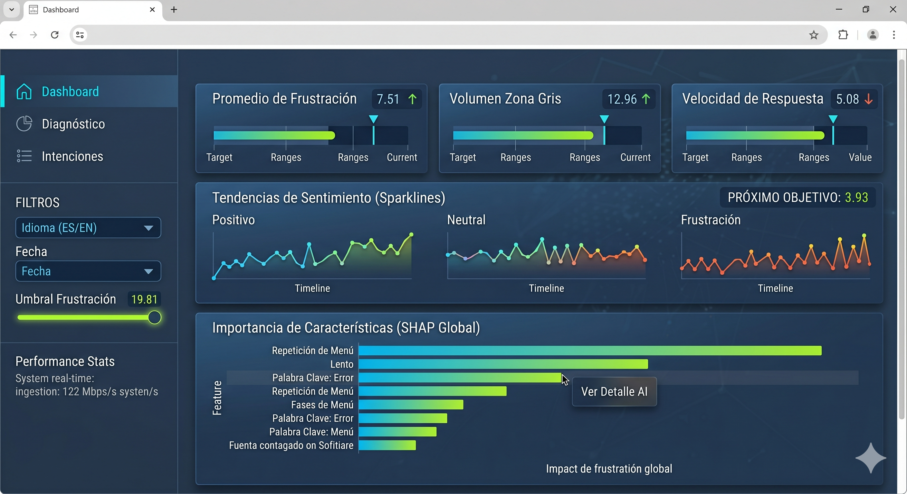
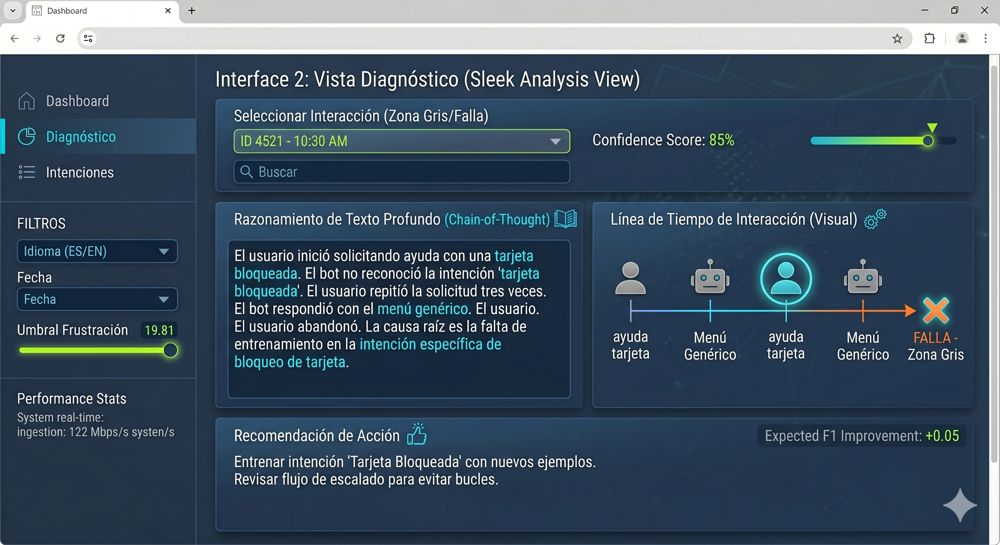
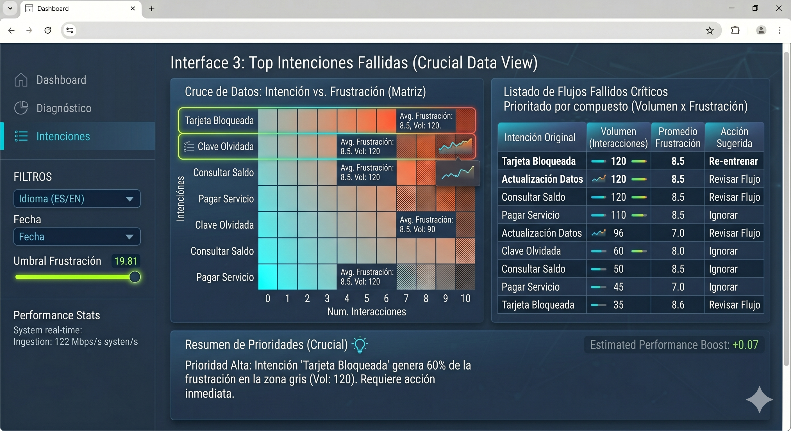
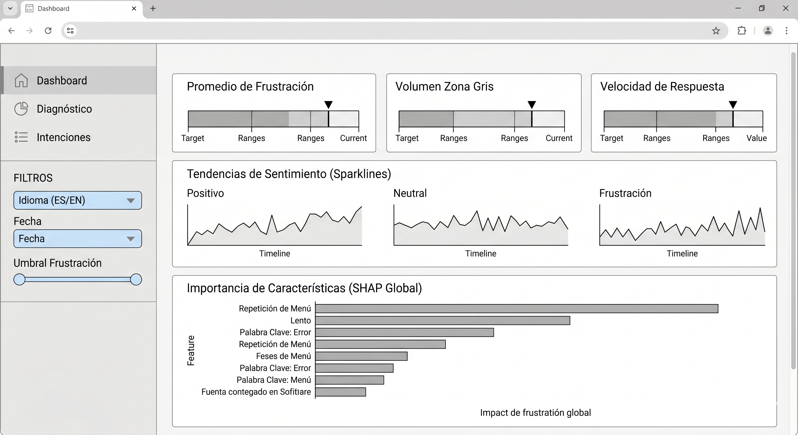
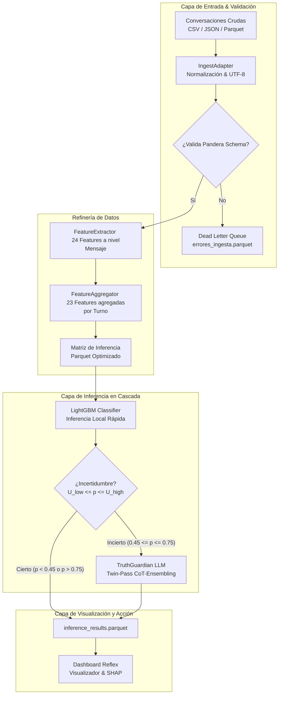

# ConversaSense AI: Arquitectura Híbrida para la Detección de Frustración y Retención Multilingüe

## 🏆 Insignias


## 📌 Índice
- [Descripción del Negocio](#-descripción-integral)
- [Mapeo de Cumplimiento Quirúrgico](#-mapeo-de-cumplimiento-quirúrgico-arquitectura-de-código)
- [Documentación Técnica Detallada](#-documentación-técnica-detallada)
- [Interfaz de la Plataforma](#-interfaz-de-la-plataforma)
- [Roles del Proyecto](#-roles-del-proyecto)
- [Arquitectura de la Solución (Cascade Learning)](#️-arquitectura-de-la-solución-refinería-de-inteligencia)
- [Estructura del Proyecto](#-estructura-del-proyecto)
- [Pipeline de Ejecución MLOps](#-pipeline-de-ejecución-mlops)
- [Privacidad Zero Trust y Gobernanza](#-privacidad-zero-trust-y-gobernanza-de-datos)

---

## 📙 Descripción Integral

**Objetivo del Proyecto:** *"Desarrollar una solución empresarial de Online Cascade Learning capaz de ingestar, validar, clasificar y diagnosticar flujos conversacionales masivos (español y portugués) en hardware estándar, combinando una Capa Rápida (LightGBM) local con una Capa Profunda (LLM Gemini 2.0 Flash) para detectar de forma temprana señales de frustración en los clientes y guiar acciones de retención."*

A continuación se demuestra arquitectónicamente **cómo** el equipo alcanzó este nivel de desarrollo industrial:

### 🎯 Mapeo de Cumplimiento Quirúrgico (Arquitectura de Código)
La justificación asertiva y el código crudo (.py) implementado por el equipo se encuentra dividido respetando los pilares de este objetivo matriz:

1. [*"...ingestar y validar flujos conversacionales..."*] -> [Ver Código: ingest_adapter.py](src/core/ingest_adapter.py) | [Ver Documentación: Requisitos](docs/análisis_requisitos.md)
2. [*"...extracción y agregación masiva de características..."*] -> [Ver Código: feature_extractor.py](src/core/feature_extractor.py) y [feature_aggregator.py](src/core/feature_aggregator.py) | [Ver Documentación: Diseño](docs/análisis_diseño.md)
3. [*"...Capa Rápida (LightGBM) local..."*] -> [Ver Código: frustration_classifier.py](src/core/frustration_classifier.py) | [Ver Documentación: Rendimiento](docs/análisis_rendimiento.md)
4. [*"...enrutamiento por incertidumbre..."*] -> [Ver Código: cascade_orchestrator.py](src/core/cascade_orchestrator.py)
5. [*"...Capa Profunda (LLM Gemini) con auditoría Twin-Pass..."*] -> [Ver Código: truth_guardian.py](src/core/truth_guardian.py) y [signal_dictionaries.py](src/core/signal_dictionaries.py)
6. [*"...dashboard interactivo responsive..."*] -> [Ver Código: dashboard.py](src/dashboard/dashboard/dashboard.py)
7. [*"...tolerancia a fallos y resiliencia SLA..."*] -> [Ver Código: stress_testing.py](tests/stress_testing.py) | [Ver Documentación: Aceptación](docs/pruebas_aceptación.md)
8. **[Gobernanza de Datos e Industrialización]** -> [Ver Documentación: Roadmap del Proyecto](docs/roadmap_proyecto.md) | [Ver Documentación: Instructivo de Pruebas](docs/instructivo_pruebas_usuario.md)

---

## 📚 Documentación Técnica Detallada
Para una comprensión profunda de las decisiones de diseño, justificaciones estadísticas y validación contra humanos, consulta el manifiesto del proyecto:

- [**📔 Plan de Implementación de la Solución**](docs/implementation_plan.md)
- [🚀 Roadmap de Hitos Consolidados](docs/roadmap_proyecto.md)
- [📊 Pruebas de Aceptación y Criterios de Éxito](docs/pruebas_aceptación.md)

---

## 💻 Interfaz de la Plataforma
| Vista de Ingesta y Calidad de Datos | Análisis de Frustración por Cascada |
|:---:|:---:|
|  |  |
| **Explicabilidad Global y SHAP** | **Métricas y Alertas de Stress SLA** |
|  |  |

---

## 👥 Roles del Proyecto
El desarrollo se estructuró dividiendo responsabilidades de la siguiente manera:
- **ML Engineer (Core & Backend)**: Garantiza la integridad temporal de la ingesta resiliente con validaciones `Pandera` y la desviación a Dead Letter Queue (DLQ). Programó el pipeline Scikit-Learn/LightGBM y los extractores vectorizados basados en `Sentence-Transformers` (MiniLM) para CPU estándar.
- **AI Engineer (Cognitive Cap & LLM)**: Diseñó el orquestador híbrido de enrutamiento por incertidumbre y el sistema anti-alucinación `TruthGuardian` con auditoría Twin-Pass CoT-Ensembling para el 15% de casos críticos.
- **Frontend & UI Developer (Dashboard Reflex)**: Asegura que el dashboard visualice los insights de frustración, variables explicativas (SHAP) y la narrativa del LLM usando Reflex (Pure Python to React) en un diseño moderno y responsive touch-first.

### 🛠️ Equipo de Desarrollo

| Integrante | Rol | LinkedIn |
| :--- | :--- | :--- |
| **Oscar Paye** | ML Engineer / AI Engineer  / Frontend| [LinkedIn](https://www.linkedin.com/in/oscar-paye01/) |

---

## ⚙️ Arquitectura de la Solución (Refinería de Inteligencia)
La plataforma opera bajo una arquitectura de **Online Cascade Learning** con el fin de optimizar el costo de inferencia (con un target de `< $5` por lote conversacional) y cumplir con estrictos SLAs en CPU:



---

## 📁 Estructura del Proyecto
El repositorio está diseñado bajo el principio de **Mantenibilidad y Simplicidad**.

```text
S04-26-Equipo-43-Data-Science/
├── data/
│   ├── raw/                            # Entradas crudas (ej: nuevas_conversaciones.csv)
│   ├── processed/                      # inference_results.parquet para el Dashboard
│   └── dlq/                            # Dead Letter Queue (errores_ingesta.parquet)
│
├── docs/                               # 📚 Especificaciones del Negocio y Técnicas
│   ├── análisis_diseño.md              # Diseño de Extracción de Variables y DST
│   ├── análisis_rendimiento.md         # Benchmark del clasificador LightGBM
│   ├── análisis_requisitos.md          # Contrato de datos y normalización de roles
│   ├── implementation_plan.md          # Plan de implementación técnica general
│   ├── instructivo_pruebas_usuario.md  # Guía para la ejecución del dashboard y ETL
│   └── pruebas_aceptación.md           # Casos de prueba UAT y métricas de F1/Kappa
│
├── models/
│   └── lgbm_model.pkl                  # Clasificador LightGBM entrenado (F1: 0.88)
│
├── src/                                # 🧱 Core Técnico (Código de Producción)
│   ├── core/                           # Núcleo de Procesamiento e IA
│   │   ├── ingest_adapter.py           # Ingesta resiliente y validación Pandera
│   │   ├── feature_extractor.py        # Extracción de 24 variables por mensaje
│   │   ├── feature_aggregator.py       # Agregación de 23 variables conversacionales
│   │   ├── frustration_classifier.py   # Clasificación binaria (LightGBM)
│   │   ├── cascade_orchestrator.py     # Orquestador del enrutamiento de incertidumbre
│   │   ├── truth_guardian.py           # LLM Second Pass con auditoría Twin-Pass
│   │   └── signal_dictionaries.py      # Regex y diccionarios de señales (ES/PT)
│   │
│   ├── dashboard/                      # Visualización Científica (Reflex App)
│   │   ├── assets/                     # Recursos visuales del dashboard
│   │   └── dashboard/
│   │       └── dashboard.py            # Componentes, State y UI en Reflex
│   │
│   └── utils/                          # Herramientas Auxiliares
│       ├── logger.py                   # Logger especializado del sistema (ES/PT)
│       └── prueba_definitiva.py        # Pipeline de ejecución ETL masivo
│
├── tests/                              # 🧪 Pruebas de Estrés y Validación
│   ├── test_model_s2.py                # Test de validación cruzada del LightGBM
│   └── stress_testing.py               # Suite integrada de stress tests (SLA/DLQ)
│
├── .env.example                        # Plantilla de variables de entorno
├── requirements_utf8.txt               # Dependencias del proyecto
└── README.md                           # Guía de Bienvenida
```

---

## 🚦 Pipeline de Ejecución MLOps

Para reproducir el entorno desde cero y levantar la plataforma de inferencia híbrida, sigue estos pasos:

### 1. Preparación de Entorno & Datos
Configure las claves necesarias y obtenga el origen de datos.
```bash
# 1. Clonar el repositorio
git clone https://github.com/No-Country-simulation/S04-26-Equipo-43-Data-Science.git
cd S04-26-Equipo-43-Data-Science

# 2. Crear y activar el entorno virtual
python -m venv .venv
source .venv/bin/activate

# 3. Instalar dependencias del proyecto
pip install -r requirements_utf8.txt

# 4. Configurar variables de entorno
cp .env.example .env
# IMPORTANTE: Configurar GEMINI_API_KEY y la ruta de los modelos si es necesario.
```

### 2. Ejecutar el Pipeline ETL & Inferencia
Carga diálogos de prueba y ejecuta la cascada completa (Ingesta -> Pandera -> Feature Extractor -> Inferencia Híbrida -> Exportación Parquet):
```bash
python src/utils/prueba_definitiva.py
```
> **Salida exitosa:** `data/processed/inference_results.parquet` y `data/dlq/errores_ingesta.parquet` (si se detectan anomalías de esquema).

### 3. Ejecutar las Pruebas de Estrés y SLAs
Valida que el sistema cumpla con los SLAs definidos bajo condiciones extremas:
```bash
python tests/stress_testing.py
```

### 4. Lanzar el Dashboard Interactivo (Reflex)
Levanta la interfaz web localmente para navegar por los diálogos clasificados e inspeccionar SHAP:
```bash
cd src/dashboard
reflex run
```

---
> [!IMPORTANT]
> **Configuración de la Capa Profunda**: Para que el orquestador de cascada pueda derivar inferencias dudosas a Gemini 2.0 Flash (`TruthGuardian`), es **indispensable** contar con una `GEMINI_API_KEY` válida configurada en tu archivo `.env`.

---

## 🛡️ Privacidad Zero Trust y Gobernanza de Datos
ConversaSense AI implementa una **doctrina de Ingesta Resiliente y Shift-Left Validation**:
- **Validación con Pandera**: El esquema estricto en [ingest_adapter.py](src/core/ingest_adapter.py) previene la filtración de datos corruptos al pipeline.
- **Resiliencia Automática**: El sistema captura datos con formatos incorrectos o inconsistencias en los campos `id_conv`, `turno` o `rol`, aislando los registros fallidos en el archivo `errores_ingesta.parquet` con el motivo exacto del fallo para auditoría posterior (DLQ), permitiendo procesar el resto de la cola sin bloqueos catastróficos.
- **Normalización Resiliente**: Mapea automáticamente variables de entrada heterogéneas como `usuario` o `customer` a la nomenclatura oficial `user`, e implementa codificaciones resilientes ante errores comunes en codificaciones de Windows/Latin-1.

---
© 2026 ConversaSense AI Team | No Country Simulation
