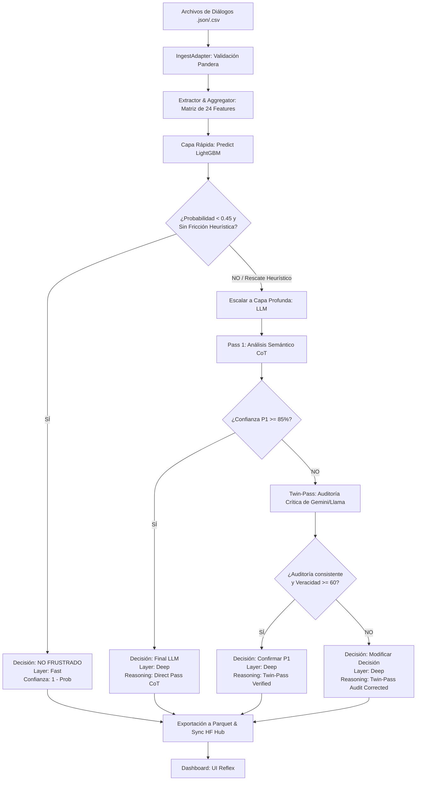

# 🏛️ Arquitectura del Sistema: ConversaSense AI

Este documento detalla la arquitectura de software, el stack tecnológico confirmado, los roles individuales de cada componente y el flujo de datos (con su routing inteligente en cascada) implementados en **ConversaSense AI** para la detección y diagnóstico de frustración en interacciones de asistentes virtuales.

---

## 1. Stack Tecnológico

El sistema está construido bajo un enfoque híbrido de Machine Learning estructurado y Procesamiento de Lenguaje Natural (NLP) avanzado, optimizado para ejecutarse en entornos locales y escalar a la nube:

### Backend & Data Science (Python 3.10+)
* **Capa Rápida (ML Local):** [LightGBM](https://lightgbm.readthedocs.io/) (instalado mediante `lightgbm`). Un clasificador basado en árboles de decisión optimizado para CPU que opera a coste computacional casi cero.
* **Procesamiento de Texto y NLP:** `sentence-transformers` empleando el modelo multilingüe `paraphrase-multilingual-MiniLM-L12-v2`. Se encarga de codificar semánticamente los mensajes y calcular la coherencia del diálogo mediante distancias de coseno.
* **Capa Profunda (LLM):** 
  * SDK de Google GenAI (`google-genai`) para llamadas estructuradas a **Gemini 2.0 Flash** (por defecto).
  * API de **OpenRouter** vía `httpx` (modelo `meta-llama/llama-3.3-70b-instruct`) como proveedor alternativo con soporte de formato JSON estructurado.
* **Validación de Datos:** [Pandera](https://pandera.readthedocs.io/) para la validación estricta del esquema de datos entrantes y salientes, asegurando la integridad lógica.
* **Explicabilidad:** [SHAP](https://shap.readthedocs.io/) (SHapley Additive exPlanations) para auditar matemáticamente el peso de las características del diálogo.
* **Persistencia y Versionado:** Hugging Face Hub (usando `huggingface_hub`) para sincronizar de forma segura el modelo clasificador `.pkl` y los datasets `.parquet` procesados en un repositorio privado remoto.

### Frontend / Dashboard (Reflex 0.6+)
* **Framework:** [Reflex](https://reflex.dev/) (permite desarrollar la aplicación web completa en Python puro compile-to-React/Next.js).
* **Gráficos y Visualización:** `reflex-echarts` (Apache ECharts) para la renderización interactiva del Heatmap, Sparklines y el gráfico de barras horizontales de importancia de variables SHAP en español.

---

## 2. Roles de cada Componente

El software está modularizado en clases con responsabilidades únicas y bien delimitadas:

```
ConversaSense AI (Root)
│
├── src/core/ (Lógica de Negocio y Modelos)
│   ├── ingest_adapter.py      -> Ingesta, tipado y validación de schemas (Pandera).
│   ├── feature_extractor.py   -> Extracción de señales de texto y embeddings multilingües.
│   ├── feature_aggregator.py  -> Agrupación a nivel de sesión (genera 24 features).
│   ├── frustration_classifier.py -> Modelo LightGBM local (Capa Rápida).
│   ├── truth_guardian.py      -> Orquestación del LLM (Pass 1 CoT + Twin-Pass Audit).
│   └── cascade_orchestrator.py-> Enrutamiento inteligente (Cascada y Rescate Heurístico).
│
└── src/dashboard/ (Interfaz de Usuario)
    └── dashboard/dashboard.py -> Control de estado reactivo y layouts visuales (Reflex).
```

### Detalle de Funciones por Componente:

1. **`IngestAdapter` ([ingest_adapter.py](file:///C:/Users/opaye/Proyectos/SC/src/core/ingest_adapter.py)):**
   * Lee fuentes de datos en crudo (`.json`, `.csv`).
   * Convierte los diálogos estructurados (historiales con roles `user`/`bot`) al formato unificado de procesamiento del sistema.
   * Aplica validaciones estrictas de tipos con Pandera para evitar caídas en el procesamiento posterior.

2. **`FeatureExtractor` ([feature_extractor.py](file:///C:/Users/opaye/Proyectos/SC/src/core/feature_extractor.py)):**
   * Analiza a nivel de mensaje las señales lingüísticas mediante expresiones regulares (sarcasmo, frustración, enojo, solicitudes de agente en ES/PT).
   * Genera los embeddings vectoriales del diálogo y calcula la similitud de coseno promedio y mínima entre mensajes consecutivos del usuario y bot para diagnosticar desvíos temáticos.

3. **`FeatureAggregator` ([feature_aggregator.py](file:///C:/Users/opaye/Proyectos/SC/src/core/feature_aggregator.py)):**
   * Agrupa los mensajes a nivel de conversación (`id_conv`).
   * Genera una matriz exacta de **24 características (features)** agregadas requeridas por el clasificador LightGBM.
   * Asegura la compatibilidad de firmas de datos previniendo fallos al cargar el modelo pre-entrenado.

4. **`FrustrationClassifier` ([frustration_classifier.py](file:///C:/Users/opaye/Proyectos/SC/src/core/frustration_classifier.py)):**
   * Carga el archivo serializado del modelo LightGBM (`lgbm_model.pkl`).
   * Realiza la predicción binaria veloz y devuelve la probabilidad estimada de frustración (`frustration_probability`).

5. **`TruthGuardian` ([truth_guardian.py](file:///C:/Users/opaye/Proyectos/SC/src/core/truth_guardian.py)):**
   * Gestiona el razonamiento semántico avanzado y la auditoría cognitiva de diálogos ambiguos empleando LLMs.
   * **Paso 1 (Pass 1):** Solicita un análisis preliminar y explicación CoT del diálogo estructurado en JSON.
   * **Paso 2 (Twin-Pass / Audit):** Si la confianza es menor al 85%, vuelve a invocar de forma asíncrona al LLM como auditor crítico para revisar inconsistencias lógicas o sesgos, y corrige la decisión final si es necesario.

6. **`CascadeOrchestrator` ([cascade_orchestrator.py](file:///C:/Users/opaye/Proyectos/SC/src/core/cascade_orchestrator.py)):**
   * Coordina el flujo de inferencia en cascada.
   * Decide si una conversación se resuelve de forma inmediata en la Capa Rápida (LightGBM) o si se deriva a la Capa Profunda (LLM).
   * Implementa los **Safety Guardrails (Rescate Heurístico)**, derivando directamente a la Capa Profunda conversaciones donde hay fallos obvios del bot (ej. consecutivas fallas del bot de no entender, desvíos DST detectados) aun si el clasificador LightGBM estimó una probabilidad baja.

7. **`DashboardState` y UI Components ([dashboard.py](file:///C:/Users/opaye/Proyectos/SC/src/dashboard/dashboard/dashboard.py)):**
   * Mantiene el estado interactivo de la aplicación Reflex.
   * Permite subir nuevos diálogos, reprocesar lotes completos, cambiar la configuración MLOps del clasificador y los proveedores LLM (Gemini vs OpenRouter/Llama), y renderizar de forma fluida el análisis SHAP con etiquetas traducidas al español.

---

## 3. Flujo de Datos y Routing en Cascada

El sistema implementa un pipeline de enrutamiento basado en la confianza de la predicción y reglas de fricción determinísticas:



### Reglas de Negocio en el Routing:
1. **Fricción Heurística (Safety Guardrails):** Si un diálogo registra `bot_fallback_count >= 2`, `bot_reboot_count >= 2`, o `dst_deviation_count >= 1`, el sistema anula la decisión de la Capa Rápida y **fuerza** la derivación a Gemini/Llama, rescatando falsos negativos del modelo tabular.
2. **Umbral de Incertidumbre ($\tau_{low} = 0.45$):** Cualquier predicción de LightGBM con probabilidad mayor o igual a 0.45 se considera incierta y es escalada al análisis semántico profundo del LLM.
3. **Calibración Twin-Pass:** La doble auditoría garantiza que solo los análisis del LLM con alta certidumbre y consistencia racional se publiquen en el dashboard final, minimizando alucinaciones.
